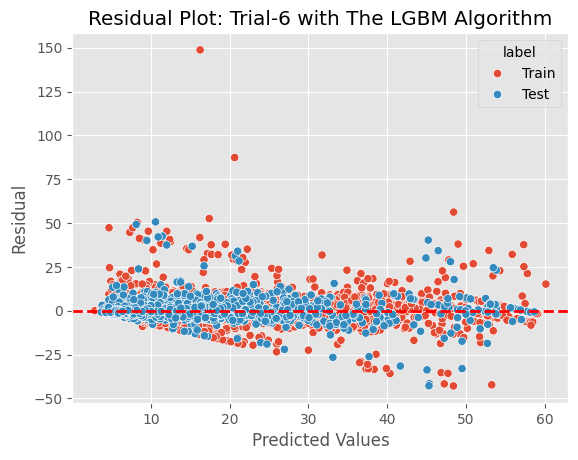

# 🚖 Taxi Fare Prediction

## 📌 Project Overview

This project focuses on predicting the fare amount for taxi rides in New York City using regression analysis. The goal was to build a robust machine learning pipeline capable of estimating fares based on spatial and temporal features.

This repository represents my final project for the **Data Science for Business Development** class at **Course-Net Indonesia**, a leading IT education platform. The dataset was provided by my data science coach specifically for this case study.

## 🚀 Key Technical Highlights

  * **Custom EDA Module:** Developed a reusable Python module for automated statistical hypothesis testing (Normality, Correlation, Chi-Square).
  * **Advanced Preprocessing:** Utilized Scikit-Learn **Pipelines** and **Custom Transformers** for modular data cleaning and feature extraction.
  * **Geospatial Engineering:** calculated geodesic distances from raw latitude/longitude coordinates using `geopy`.
  * **Hyperparameter Tuning:** Implemented **Optuna** for Bayesian optimization of model parameters.
  * **Model Stacking:** Benchmarked Linear Regression, Lasso, Ridge, **LightGBM**, and **CatBoost**.

-----

## 🛠️ Methodology

### 1\. Data Cleansing & Anomalies Handling

Before modeling, the raw data underwent rigorous cleaning to remove noise that would skew the regression:

  * **Coordinate Anomalies:** Removed rides with `0.0` coordinates (locations in the ocean) or coordinates outside NYC boundaries.
  * **Fare Logic:** Filtered out negative fare amounts and unrealistic passenger counts.
  * **Missing Values:** Handled via a custom `NumericalFeatureImputer` within the pipeline.

### 2\. Feature Engineering

Raw data was transformed into meaningful predictors:

  * **Distance Calculation:** Created a `distance` feature (miles) using the **Ellipsoid GRS-80** geodesic formula.
  * **Temporal Extraction:** Decomposed `pickup_datetime` into `year`, `month`, `day_of_week`, and `hour` to capture traffic patterns and seasonality.

### 3\. Automated Exploratory Data Analysis (EDA)

I developed a custom module, `SimpleExploratoryDataAnalysis.py`, to automate statistical rigor. Instead of just visualizing data, this module:

  * **Dynamic Normality Testing:** Automatically selects between **Jarque-Bera, D’Agostino’s K-squared, or Shapiro-Wilk** based on sample size.
  * **Smart Correlation:** Dynamically chooses **Pearson** vs. **Spearman** correlation based on the normality of the data distribution.
  * **Independence Testing:** Performs Chi-Square tests for categorical variables.

*Snippet of the custom logic used in the project:*

```python
# Logic from my custom module to select the correct correlation test
if p_val_norm_val <= norm_alpha_threshold:
    corr_test_type = "Spearman" # Non-parametric
else:
    # Check target normality
    if stats.jarque_bera(data_1[target])[1] < 0.05:
        corr_test_type = "Spearman"
    else:
        corr_test_type = "Pearson" # Parametric
```

### 4\. Model Building & Tuning

I utilized `sklearn.pipeline.Pipeline` to prevent data leakage and ensure reproducibility. The models were tuned using **Optuna** with 100 trials to maximize the $R^2$ score.

| Algorithm | $R^2$ Score (Test) | Note |
| :--- | :--- | :--- |
| **LightGBM** | **0.81** | **Best Performing Model** |
| CatBoost | 0.81 | Runner up |
| Ridge/Lasso | \~0.74 | Baseline |
| Linear Regression | \~0.25 | Poor fit for non-linear spatial data |

-----

## 📊 Results & Evaluation

The **LightGBM** model was selected as the final model due to its speed and high predictive accuracy.

  * **Test $R^2$:** 0.81
  * **Test RMSE:** \~$4.06 USD
  * **Test MAPE:** \~20%

### Residual Analysis

The residual plot demonstrates that the model captures the trend well, with errors centered around zero, though variance increases slightly with higher fare amounts (heteroscedasticity common in financial data).



-----

## 📂 Repository Structure

```text
├── data/                      # Dataset folder (Gitignored)
├── figures/                    # Visualizations for README
├── SimpleExploratoryDataAnalysis.py  # CUSTOM EDA MODULE (Core Component)
├── Taxi_Fare_Prediction_Regression.ipynb  # Main Jupyter Notebook
├── requirements.txt           # Python dependencies
└── README.md                  # Project documentation
```
